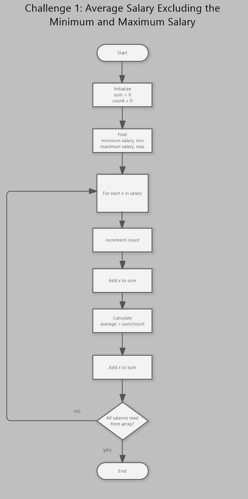
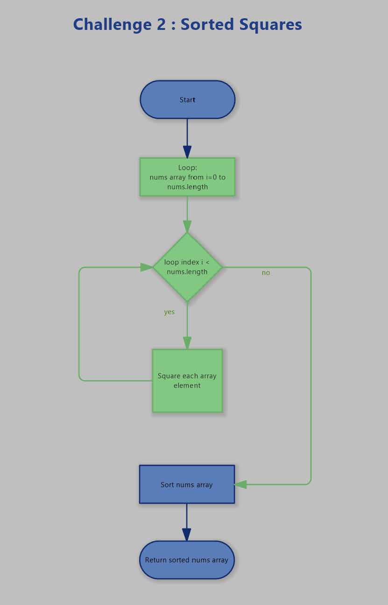
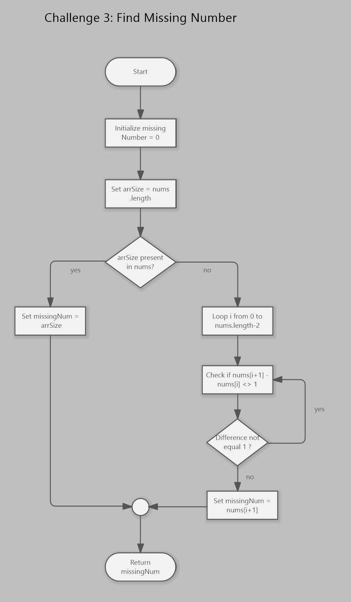
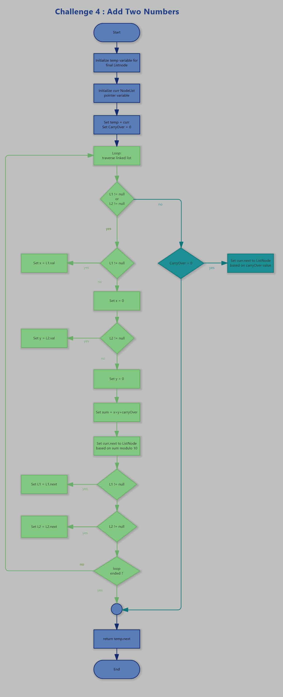
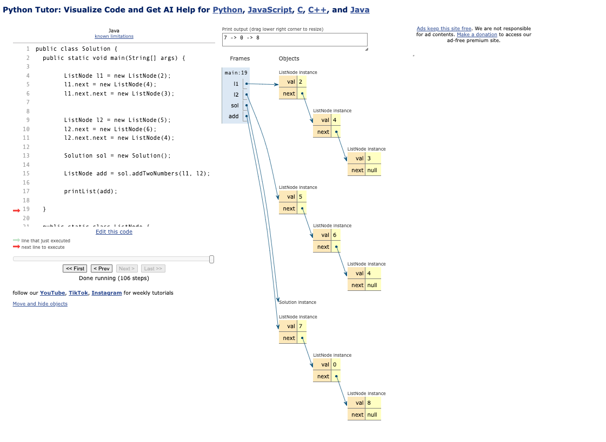
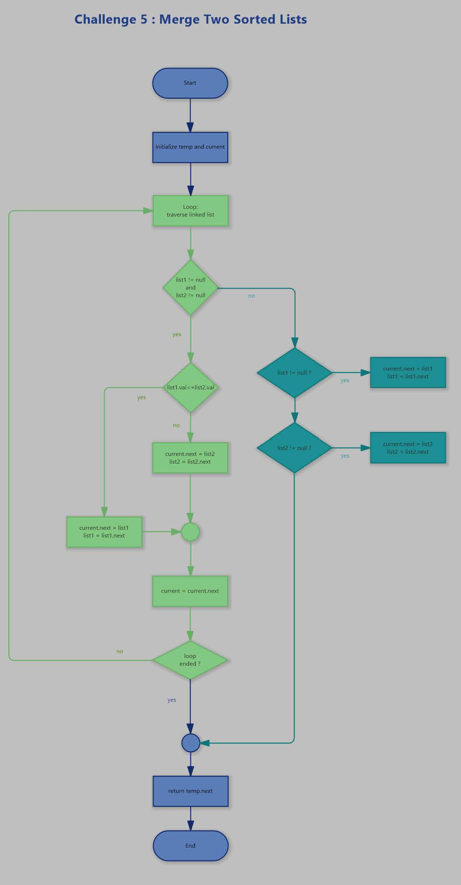

# Team 9 Leet Code Challenge

We worked together as a team to solve the assigned LeetCode problems. We combined efforts and diverse perspectives which led to the solutions below. This GitHub Repository will host our solutions and explanations of how each solution was reached.

## The LeetCode Questions

* [Average Salary Excluding the Minimum and Maximum Salary](https://leetcode.com/problems/average-salary-excluding-the-minimum-and-maximum-salary/description/)
* [Squares of a Sorted Array](https://leetcode.com/problems/squares-of-a-sorted-array/description/)
* [Missing Number](https://leetcode.com/problems/missing-number/description/)
* [Add Two Numbers](https://leetcode.com/problems/add-two-numbers/description/)
* [Merge Two Sorted Lists](https://leetcode.com/problems/merge-two-sorted-lists/description/)

## Average Salary Excluding the Minimum and Maximum Salary

1. Initialize variables sum = 0.0 count = 0
2. Find minimum and maximum salary in the array min = find minimum value in salary array max = find maximum value in salary array
3. Iterate through given array of salaries For each x in salary do:
  If x > min AND x < max then: count = count + 1 // Increment valid salary count sum = sum + x // Add valid salary to sum
4. Calculate the average of valid salaries average = sum / count
5. Return the calculated average Return average
   

  

## Squares of a Sorted Array

1. Loop through the array using a for loop
2. Inside the loop square each value by multiplying it by itself 
3. Sort the resulting array
4. Return the array

  

## Missing Number

1. Intialize a missing num variable as missedNum
2. Count the elements in the array and store them inside a variable arrSize
3. Check if that array size number is present in the array
4. Sort the numbers in the array
5. Check if that array size number is present in the array
6. Find the difference between the num at current index and the num at i + 1
7. If the difference is not equal to 1, there is a missing number
8. If that array size number is not present in the array return that num

  

## Add Two Numbers

1. Create a temporary head for our final Linkedlist
2. Set the pointer or iterator to traverse the linked list
3. Create a variable to hold the carryover value
4. Traverse the linked list as long as the nodes are not null
5. Create two variables x and y to hold the current value in l1 and l2 respectively
6. If l1 is not null assign the current value to x, if not assign 0
7. If l2 is not null assign the current value to y, if not assign 0
8. Calculate the sum of x,y and the carryover value and assign it to the sum variable
9. Calculate the carryover number by dividing the sum by 10 and assign it to the carryOver variable
10. Assign the remainder of dividing the sum by 10 to the curr.next (the next ListNode in curr)
11. Change the current pointer to the next ListNode
12. If l1 is not empty move to the next ListNode
13. If l2 is not empty move to the next ListNode
14. After the while loop concludes, if the carryOver is greater than 0, add it as the final ListNode
15. Finally, return the temp.next

  

  

## Merge Two Sorted Lists

1. Create a temporary list note just to hold the head of the linked list and so we can traverse it
2. Set the pointer or iterator to traverse the linked list
3. We traverse the linked list as long as the nodes are not null
4. If list1 is smaller, val of list1 will be the next node in the new linked list
5. If list2 is smaller, val of list2 will be the next node in the new linked list
6. Move the pointer to the next node
7. Handle the remaining nodes in l1, if they exist by appending them to the current list
8. Handle the remaining nodes in l2, if they exist by appending them to the current list
9. Return next node of the temp node which is the starting point (head) of the merged list

  

##
